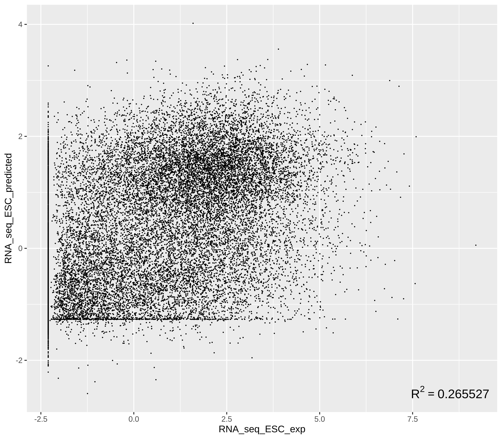

# Genomics Paper Modernization to mm39

## Content
This independent project is dedicated to align the reads that **Ouyang et al. (2009)** used, to the modern mm39 mouse genome and apply **Ouyang et al. (2009)**'s predictive model to the new data. This repository contains the scripts used for the project and the scripts for downloading the data.

## Current status

## Tools
hisat2
bowtie2
samtools
bedtools
Subread

## Citation
**1-** Z. Ouyang, Q. Zhou, & W.H. Wong, ChIP-Seq of transcription factors predicts absolute and differential gene expression in embryonic stem cells, Proc. Natl. Acad. Sci. U.S.A. 106 (51) 21521-21526, [https://doi.org/10.1073/pnas.0904863106](https://doi.org/10.1073/pnas.0904863106) (2009).

**2-** The data for this study have been deposited in the European Nucleotide Archive (ENA) at EMBL-EBI under accession number PRJNA106455 [https://www.ebi.ac.uk/ena/browser/view/PRJNA106455](https://www.ebi.ac.uk/ena/browser/view/PRJNA106455).

**3-** The data for this study have been deposited in the European Nucleotide Archive (ENA) at EMBL-EBI under accession number PRJNA30467 [https://www.ebi.ac.uk/ena/browser/view/PRJNA30467](https://www.ebi.ac.uk/ena/browser/view/PRJNA30467).

**4-** Casper, J., Speir, M. L., Raney, B. J., Perez, G., Nassar, L. R., Lee, C. M., Hinrichs, A. S., Gonzalez, J. N., Fischer, C., Diekhans, M., Clawson, H., Benet-Pages, A., Barber, G. P., Vaske, C. J., van Baren, M. J., Wang, K., Rodriguez, Y. J. P., Jenkins-Kiefer, J. A., Chalamala, M., Haussler, D., … Haeussler, M. (2026). The UCSC Genome Browser database: 2026 update. Nucleic acids research, 54(D1), D1331–D1335. [https://doi.org/10.1093/nar/gkaf1250](https://doi.org/10.1093/nar/gkaf1250)

**5-** Karolchik D, Hinrichs AS, Furey TS, Roskin KM, Sugnet CW, Haussler D, Kent WJ. The UCSC Table Browser data retrieval tool. Nucleic Acids Res. 2004 Jan 1;32(Database issue):D493-6.

## Author
Siyabend Akdemir
